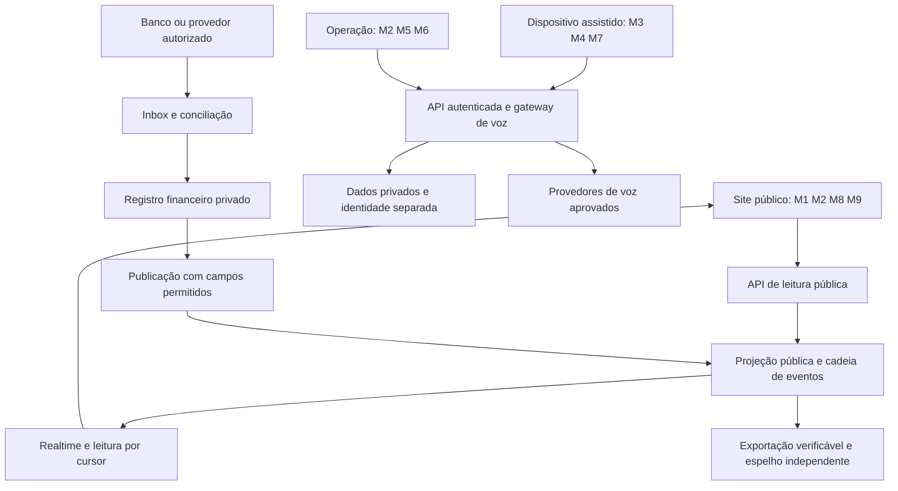

# Arquitetura proposta · VidaNova

F02, etapa 1 · 22/09/2026 · responsável: EngenheiroFino · **proposta para revisão do Regente; implementação depende de OK**.

Referências de escopo: [PRD](../PRD.md), [decisões vigentes](../DECISOES.md) e [brief F02](../frentes/F02-engenharia-base/BRIEF.md). Este desenho não autoriza publicar, contratar serviço, receber doações ou tratar dados reais. Escolhas, limites operacionais e metas abaixo são propostas de engenharia; capacidades e preços externos têm fontes com data de consulta.

## 1. Mapa do sistema e responsabilidade humana

Proponho um monólito modular: um repositório, um contrato de dados e uma base PostgreSQL, com frontend estático e backend gerenciado. Cada módulo tem funções de aplicação e tabelas próprias; dinheiro, entrevista e identidade se encontram somente por interfaces autorizadas. Não precisamos iniciar com microsserviços, aplicativo nativo, blockchain ou mecanismo de busca vetorial.

| PRD | Software proposto | Trabalho humano e limite |
|---|---|---|
| M1 · Site público | Páginas por blocos; estado de cada módulo; painel público; acessibilidade | Design e admin validam texto, promessas e informações publicadas. Zero só quando confirmado; indisponibilidade não vira zero |
| M2 · Doação e transparência | Adaptador de provedor, conciliação, livro-caixa, comprovantes expurgados, atualizações públicas | Titular de conta e estrutura jurídica dependem do Lucas/F03. Tesouraria confirma divergências; outro operador aprova gastos |
| M3 · Captação | Registro mínimo pseudonimizado, atribuição a voluntário e agenda | Abordagem, segurança de campo, confiança e critério de atendimento são operação. IA não mede caráter ou merecimento |
| M4 · Entrevista por voz | Sessão por turnos, consentimento, STT/LLM/TTS, resumo para revisão | Voluntário acompanha; candidato pode parar ou pedir pessoa. Decisão de seleção humana é proposta ainda pendente no PRD |
| M5 · Ponte inicial | Solicitação, aprovação, compra, confirmação de entrega, vínculo privado com gastos | Pessoas compram e entregam comida/roupa/higiene. Comprovante financeiro não prova sozinho que houve entrega |
| M6 · Oportunidades | Vagas moderadas, encaminhamento consentido e acompanhamento | Equipe verifica empregadores e vagas. Empregador recebe apenas perfil autorizado, nunca entrevista inteira |
| M7 · IA contínua | Reutiliza gateway de voz e sessão assistida; orçamento por sessão | Acesso de quem não tem celular permanece assistido. Recuperação de acesso e suporte são humanos; não prometer atendimento de emergência |
| M8 · Governança | Repositório, revisão de PR, CI e trilha de auditoria | Lucas/admin aprovam contribuição; Regente integra. Formalização, licença e abertura do repo são decisões organizacionais |
| M9 · Marca e domínio | Tokens visuais e configuração de nome/domínio | Pesquisa, decisão de nome, compra e marca ficam com Lucas/Regente; nome atual é provisório |

## 2. Stack, hospedagem e custo

| Camada | Proposta | Motivo e compromisso |
|---|---|---|
| Interface | Astro estático + TypeScript; React apenas nas ilhas de painel, operação e entrevista; CSS com tokens da F01 | Conteúdo informativo entregue em HTML; JavaScript carregado onde necessário. Astro oferece hidratação seletiva e integração com React [S1]. A interface privada é um shell sem dados no build |
| Hospedagem web | Cloudflare Pages, assets estáticos; API em origem separada | Deploy de diretório estático é simples e portátil. Plano Free tem limites de build/arquivos [S2]. Domínio, conta e publicação só após autorização |
| Backend | Supabase Edge Functions em TypeScript/Deno; lógica pura compartilhada, validação de entrada e SQL versionado | Reúne APIs junto de Auth, Storage e Postgres. Adaptadores isolam pagamento e voz. Uma função curta por comando/turno; sem manter entrevista de 10 min numa execução |
| Banco | PostgreSQL gerenciado no Supabase, região específica `sa-east-1` (São Paulo) | Relações, transações, restrições únicas e controle de concorrência sustentam dinheiro e permissões. Região disponível documentada [S3]. Região do banco não garante que voz, logs ou suporte permaneçam no Brasil |
| Login e objetos | Supabase Auth para equipe, MFA para privilégios; Storage privado para originais e separado para cópias públicas | Identidade do candidato não depende de email, celular ou documento. URLs assinadas curtas para anexos privados; objetos públicos apenas após revisão |
| Atualização | Supabase Realtime sobre tabela exclusivamente pública; leitura HTTP por cursor para recuperar perdas | Postgres Changes oferece assinatura das alterações [S4]. Evento é aviso para buscar dados, não fonte exclusiva do saldo |
| Desenvolvimento | Node LTS suportado fixado, npm/lockfile, Supabase CLI + Docker para backend local; Deno para funções | Home deve rodar sem conta externa. CLI permite serviços locais [S5]. Versões exatas serão fixadas na etapa 2; não adotar versões experimentais |
| Qualidade, depois do OK | ESLint, TypeScript, Vitest; testes de integração SQL e Playwright nos fluxos de risco; GitHub Actions | Testar invariantes financeiras, acesso entre papéis e recuperação. CI de PR usa apenas dados fictícios e nenhum segredo de produção |

**Alternativas consideradas:** Next.js é viável, mas SSR generalizado e adaptação de runtime não trazem benefício suficiente à home estática nesta fase; React continua disponível nas ilhas. Um servidor Node + Postgres próprio mantém mais controle, mas adiciona operação e backup à equipe. Se limites do backend impedirem o piloto, migrar o gateway para serviço Node de longa duração sem mudar contratos, após novo orçamento. Não manter duas stacks ativas preventivamente.

**F1 independente do backend:** por orientação do Regente em 22/09/2026, o site e o painel inicial serão arquivos estáticos e subirão sem Supabase, Auth ou chave externa. Enquanto nenhuma doação estiver habilitada, um snapshot versionado e confirmado pela operação mostrará zero, data de referência e “Doações ainda não habilitadas”. Não indicar conexão ao vivo. F2 substitui a fonte estática pelo contrato público; se já houver movimentações reais, o snapshot deve refletir o livro conciliado e nunca continuar zerado por conveniência.

**Orçamento inicial proposto:** F0/F1 estático e desenvolvimento local podem começar em US$ 0 de infraestrutura dentro das franquias, excluindo domínio, trabalho, conectividade e hardware. Supabase Free publica 500 MB de banco, 1 GB de arquivos, 5 GB de egress, 200 conexões Realtime e 2 milhões de mensagens/mês; pausa após uma semana inativo e não inclui backups automáticos. Pro parte de US$ 25/mês, sujeito a consumo [S6]. Não basear continuidade de atendimento ou dinheiro real no Free sem orçamento e procedimento de recuperação aprovados. Reservar ao menos o plano Pro como referência de orçamento antes dessa fase; não contratar agora.

As Edge Functions limitam duração a 150 s no Free/400 s nos pagos e CPU a 2 s por requisição [S7]. Portanto, não executar STT local, conversão pesada de arquivos ou socket de dez minutos nelas. Na F09 medir turnos de áudio pequenos; processamento que exceda esses limites exige outro runtime. Publicar limite de custo por sessão, teto diário de IA e alertas a 70%/90% das franquias, com interrupção compreensível e atendimento humano ao atingir o teto. SMTP, retenção/backup de arquivos, processamento de comprovantes, espelho independente e tarifas de pagamento devem entrar no orçamento da fase correspondente.

**Meta de experiência, ainda não medida:** conteúdo inicial útil sem JavaScript, JS inicial público até 100 KB gzip, nenhuma biblioteca de voz na home, imagens com dimensões e carregamento adiado, LCP até 2,5 s no aparelho/rede definidos para o teste. Projetar WCAG AA com teclado, foco visível, alvos grandes, contraste, redução de movimento e confirmação falada. A F01 define a aparência; F07 valida em celular barato real.

## 3. Modelo de dados inicial

Schemas lógicos propostos: `identity` (identificação), `care` (acompanhamento), `finance` (originais e conciliação), `audit` (eventos internos) e `api_public` (publicação). Os quatro primeiros não são expostos pela Data API nem pelo Realtime público. Autorizações no backend e no banco; identificador aleatório não substitui controle de acesso.

Todos os IDs internos são UUID aleatórios; datas técnicas usam UTC, apresentação em `America/Sao_Paulo`; moeda BRL e valores em centavos inteiros, sem ponto flutuante. No JSON público, inteiros grandes são strings decimais para evitar arredondamento. Chaves estrangeiras, unicidade e transições válidas são impostas no banco.

| Entidade | Campos e relações mínimos | Exposição e ciclo |
|---|---|---|
| `candidate` | `id`, `case_status`, `assigned_volunteer_id`, `created_at`, `retention_due_at` | Pseudônimo interno. Não há perfil público individual por padrão. Ausência de CPF/telefone não impede atendimento |
| `candidate_identity` | `candidate_id` único, nome preferido e meio de contato opcionais cifrados, referência de chave | Separada do caso. Não coletar documento, localização exata ou biometria por rotina |
| `consent_record` | candidato/sessão, finalidade, versão do aviso, idioma, aceite/recusa/revogação, horário, operador, forma de manifestação e eventual evidência privada | Uma finalidade por registro; entrevista, envio à IA, empregador e relato público não compartilham um aceite genérico |
| `interview` / `interview_turn` | candidato, voluntário, versão do roteiro/modelo, sequência de turno, estado, texto mínimo confirmado, resumo, custo, prazo de exclusão | `created → consented → active → completed/interrupted/withdrawn`; áudio efêmero por padrão; resumo revisável e decisão humana separados |
| `selection_review` | candidato/entrevista, revisor, decisão, fundamento objetivo, versão, pedido de revisão | Sem escore de merecimento. IA sugere perguntas/resumo; proposta de decisão fica pendente até confirmação humana |
| `donation` | provedor, referência externa privada, valor bruto, taxa, líquido, moeda, estados e horários distintos de confirmação/liquidação | Identidade de doador opcional e privada. `pending`, `confirmed`, `settled`, `refunded`, `disputed` não são sinônimos |
| `expense` / `expense_approval` | categoria, valor, solicitante, aprovador diferente, pagamento externo privado, referência opcional de entrega | Rascunho, aprovado, pago, conciliado; vínculo candidato/gasto só interno. Não efetuar pagamentos automaticamente no piloto |
| `receipt` / `receipt_version` | objeto original, objeto expurgado, hashes separados, tamanho/tipo, revisor, status, versão anterior | Originais privados. Uma movimentação pode ter vários documentos e um documento cobrir várias movimentações, com tabela de vínculo e rateio |
| `financial_movement` | conta interna, referência de origem única, direção, valor, moeda, tipo, `occurred_at`, `observed_at`, estado de conciliação | Fato interno de caixa; vínculo com doação/gasto/taxa/estorno. Extrato e payload bruto nunca públicos |
| `ledger_event` | sequência, ID público independente, tipo, delta em centavos, moeda, categoria permitida, data pública, `published_at`, referência pública corrigida, hashes de versões públicas, hash anterior/atual | Somente payload permitido e imutável. Sem candidato, doador, CPF, chave Pix, localização ou texto livre; apelido público identifica somente a movimentação |
| `job` / `referral` | empregador verificado, descrição moderada, local aproximado, remuneração, estado; encaminhamento privado por candidato e autorização | Vaga só após moderação. Histórico de vulnerabilidade não é requisito nem atributo público |
| `volunteer` / `case_assignment` | usuário Auth, estado ativo/revogado, treinamento, atribuição e validade | Acesso aos próprios casos ativos, auditado. Revogação encerra acesso |
| `admin` / `role_grant` | usuário Auth, papel, escopo, quem concedeu/revogou e quando | Admin é concessão de permissão, nunca senha em tabela. Papéis sensíveis separados |
| `provider_inbox`, `outbox`, `audit_event`, `reconciliation_run` | chaves de idempotência, tentativas/erro, eventos internos, cursor público, diferenças e responsáveis | Inbox/outbox controlam entrega; auditoria registra ator/ação/alvo/resultado sem copiar conteúdo íntimo |

Cardinalidades centrais: candidato 1:N entrevistas e encaminhamentos; entrevista 1:N turnos; doação/gasto 1:N movimentos (taxa, estorno, liquidação); movimento 1:N eventos públicos de publicação/correção; recibo N:M movimentos. Totais são derivados, nunca um campo editável por admin. Projeções de estado podem ser reconstruídas a partir dos eventos e evidências privadas autorizadas.

## 4. Livro-caixa público, verificável e atualizado

### 4.1 Do fato financeiro à linha pública

1. **Capturar:** webhook validado sobre corpo original e assinatura, com proteção contra replay conforme contrato do provedor. Persistir `provider_inbox` com chave única `(provider, event_id)` antes de responder sucesso. Evento sem assinatura válida não é confirmação. Retorno do navegador e foto de Pix não liquidam doação.
2. **Confirmar e conciliar:** consultar estado autoritativo no provedor quando necessário e importar extrato para reconciliar banco, provedor e livro. Unicidade adicional por referência da transação/tipo evita dupla contabilização de eventos diferentes do mesmo pagamento. Eventos fora de ordem passam pela máquina de estados; divergência vai para revisão. F03 define provedor e semântica antes da F08.
3. **Registrar caixa:** transação grava movimento, evidência privada, auditoria e item de outbox para publicação. Compra aprovada não é saída; pagamento efetivado é. Separar dinheiro confirmado, a liquidar e disponível. Tarifas, devoluções, chargebacks e custos operacionais aparecem explicitamente. Transferência entre contas próprias tem par de lançamentos e efeito agregado zero; saldo inicial é evento identificado.
4. **Publicar mínimo seguro:** evento financeiro público com valor, categoria controlada, data e status de evidência pode sair sem esperar expurgo completo. Comprovante pendente deve ficar visível como pendente e entrar na métrica de atraso. O documento público só é vinculado após revisão humana de expurgo. Não ocultar movimento por falta de recibo. A meta de 100% de comprovação é acompanhada, não simulada.
5. **Atualizar:** uma função transacional publica evento, atualiza cabeça da cadeia e registra cursor. Depois do commit, Realtime avisa leitores. Outbox tem retries com backoff, chave única e fila de falhas para operador. Falha de publicação não desfaz pagamento nem perde a obrigação de publicar.

A projeção pública deliberadamente não carrega IDs internos. A regra é de schema: DTO e tabela com lista fechada de campos, tipos e categorias, sem JSON arbitrário, campos pessoais ou texto livre; testes devem rejeitar atributos extras antes de inserir. “Pseudônimo” público significa apelido aleatório da movimentação, sem pessoa associável. Pseudônimo de candidato continua dado pessoal e não entra no livro. Original bancário e vínculo de atendimento ficam privados. O comprovante público remove nome, CPF, telefone, endereço, conta, chave Pix, QR/barcode, assinaturas, metadados e camadas de texto recuperáveis. Revisar também itens que revelem saúde/religião e identificação por combinação de data/estabelecimento/valor. Quando expurgo destruir a utilidade, publicar atestado resumido da movimentação e disponibilizar original apenas ao auditor autorizado, explicitando o nível de evidência.

**Exemplo fictício:** doação de R$ 100,00, taxa R$ 2,00 e repasse de R$ 98,00 geram entrada bruta de 100 e taxa de 2, conciliadas com líquido 98; o repasse não é uma segunda doação. Se o provedor somente reconhecer receita na liquidação, aplicar essa regra consistentemente e mostrar o pendente separado. Um erro de valor de 98 registrado como 980 é corrigido por evento inverso vinculado e evento correto, sem apagar a linha anterior. Reembolso real reduz arrecadação líquida; correção contábil deve ser rotulada para não parecer novo dinheiro.

### 4.2 Append-only, cadeia e espelho

Apenas a função de publicação pode inserir `ledger_event`. Retirar `INSERT/UPDATE/DELETE/TRUNCATE` dos papéis de aplicação, concedendo execução da função restrita; owner de migração separado do runtime. Triggers bloqueiam mutações como defesa adicional. RLS não protege contra todo papel privilegiado; credenciais de serviço podem ultrapassá-la [S8]. Mudanças de schema exigem revisão e registro operacional.

Serializar publicações bloqueando uma única linha `ledger_head` com `SELECT ... FOR UPDATE` dentro da transação; incrementá-la só no commit e impor unicidade de sequência e origem. Locks de linha do PostgreSQL permitem esse controle [S9]. Não fazer chamadas HTTP dentro do lock. Essa serialização é adequada ao volume inicial proposto; medir antes de dividir cadeias.

Formato proposto: `hash = SHA-256(UTF8(JCS({schema_version, sequence, previous_hash, payload})))`, com hash anterior inicial de 64 zeros, campos explicitamente presentes, valores monetários e sequência como strings decimais e datas em formato fixo. `payload` só contém dados já aprovados para publicação e hashes dos **arquivos públicos expurgados**. A serialização canônica JCS é especificada no RFC 8785 [S10]. Não usar hash de CPF, áudio ou original privado como suposta anonimização. Publicar contrato e verificador independente com vetores de teste na F08.

Correção gera evento novo (`reversal`, `replacement`, `receipt_attached`, `receipt_withdrawn`), com referência ao anterior; total considera deltas, anexação não movimenta dinheiro. CSV é exportação de conveniência; JSON canônico é a fonte de verificação. Verificador checa sequência, encadeamento, integridade dos arquivos disponíveis, referências de correção e totais, sem credencial de produção.

**Espelho proposto, ainda não criado:** exportar lote e manifesto `{first_sequence,last_sequence,head_hash,generated_at}` a cada 5 min e snapshot diário, assinados com chave identificada e rotacionável. Copiar para armazenamento público em conta separada, com retenção/versionamento e operador independente; permitir cópias por terceiros. Publicar chave e histórico de rotação por canal independente. Avaliação solicitada pelo Regente: um repo irmão público somente para snapshots é preferível ao repo de código, pois separa volume, permissão de escrita e revisão de anexos. O JSON canônico, manifesto e assinatura podem entrar por commits automáticos sem reescrever histórico; comprovantes maiores ficam em armazenamento próprio e são referenciados pelo hash público. Branch protegida e credencial limitada reduzem alterações acidentais, mas admin ainda pode reescrever ou excluir o repo; histórico Git, sozinho, não equivale a espelho independente. Manter cópia sob outra custódia e verificador comparando as duas cabeças. A abertura desse repo também precisa do OK do Lucas; até existir, declarar “espelho ainda não ativo”. Nomear custodiante, frequência e custo antes de afirmar que o espelho existe. Falha deixa atraso e último hash replicado visíveis.

Uma cadeia no mesmo banco pode ser reescrita por superusuário. Espelho/assinatura permitem detectar divergência em relação a uma cópia conhecida; não impedem conluio, comprometimento de todas as chaves, omissão de dinheiro antes do registro ou fraude no mundo real. Conciliação diária com extrato, separação de funções e auditoria independente continuam necessárias. O painel mostra data da última conciliação e diferenças não resolvidas.

**Exposição acidental:** interromper entrega do anexo, purgar caches sob controle e registrar evento público de retirada sem repetir o dado; manter acesso restrito para resposta ao incidente. Cópias de terceiros não são reversíveis. Se dado pessoal entrou no payload imutável, priorizar resposta de privacidade e procedimento de migração/redação auditável da cadeia, publicando a descontinuidade e nova âncora sem republicar o dado. Não prometer simultaneamente apagamento absoluto e publicação permanente. A proteção principal é um schema sem texto livre e revisão antes de qualquer anexo público.

### 4.3 O significado de “ao vivo”

Metas propostas: p95 até 60 s entre observação confirmada pelo sistema e publicação mínima; até 5 s entre publicação e cliente conectado; anexos expurgados até um dia útil, com atraso explícito. Não são garantias do banco/provedor. Guardar `occurred_at`, `observed_at`, `published_at` e hora de recepção no cliente; medir cada atraso separadamente. A data pública pode ter precisão reduzida para proteção, mantendo horários técnicos privados.

Cliente assina, busca snapshot com cursor consistente e busca eventos após o cursor; deduplica por sequência. A cada reconexão e periodicamente, compara a cabeça e recupera lacunas por HTTP, sem confiar na entrega do WebSocket. Fallback de polling de 30 s com backoff e pausa em aba oculta. Totais e sequência vêm do mesmo snapshot transacional. Falha mostra “Atualização indisponível; última confirmação às …”, conservando última leitura com data, nunca marcando cache como ao vivo. Zero só após resposta válida indicando livro vazio. Exportação e “última conciliação” continuam acessíveis mesmo sem Realtime.

## 5. Entrevista por voz e dispositivo

### 5.1 Contrato de alto nível

O piloto proposto é assistido por voluntário, em Android existente, com voz por turnos `captura → STT → confirmação → LLM → TTS`. A comparação F04 abrange fala a fala em tempo real, ligação, WhatsApp e totem; a síntese e os limites para implementação ficam na seção 5.2.

O aparelho pede permissão de microfone somente após explicação falada. Primeiro toca aviso local pré-gravado; somente depois da manifestação válida e registrada envia áudio ao operador externo aprovado. Mostrar e falar estados de ouvir, processar, responder, pausar e terminar. Botão grande e comandos simples; cor nunca é a única informação. Não representar a IA como pessoa, terapeuta ou avaliador de caráter.

Cada turno tem `session_id`, número sequencial, chave idempotente, versão do roteiro e prazo. O backend autoriza escopo e duração, aplica orçamento e consulta estado antes de repetir chamada paga. Estados desconhecidos vão para reconciliação, não retry cego. Respostas carregam ID de turno para descartar áudio atrasado. “Parar” cancela reprodução e requisição quando possível; não garante estorno do provedor. Confirmações importantes são repetidas pela voz e corrigíveis pelo candidato.

Separar contratos `SpeechRecognizer`, `InterviewAssistant` e `SpeechSynthesizer`; armazenar métricas de duração, falha, interrupção e custo sem conteúdo. Modelos não recebem ferramentas para selecionar, pagar, publicar, acessar identidade ou navegar livremente. Conteúdo falado é dado não confiável; resposta estruturada deve passar por schema e regras fixas. Recomendações ficam como rascunho privado, vinculadas a versão/modelo e revisadas por pessoa.

Na rede ruim, salvar somente estado mínimo já confirmado no servidor; manter áudio temporário em memória e eliminar ao encerrar. Não guardar entrevista em `localStorage`, service worker ou fila persistente do aparelho. Shell e avisos neutros podem funcionar offline; entrevista com IA online deve pausar e oferecer conversa humana. Não afirmar que STT offline roda bem no celular barato sem ensaio. Limpar sessão entre pessoas, expirar autorização e revogar remotamente dispositivo perdido.

### 5.2 Consolidação F04

Pesquisa delegada ao Devin na [PR F04 #1](https://github.com/LucasOl1337/VidaNova/pull/1), revisada pelo EngenheiroFino e recuperada em worktree próprio após falha do provedor, conforme autorização do Regente. Resultado consolidado na [PR F04 #3](https://github.com/LucasOl1337/VidaNova/pull/3), que substitui a #1; [relatório revisado no commit 6444fb3](https://github.com/LucasOl1337/VidaNova/blob/6444fb373ca4c84740f300191837adc7b9398f85/docs/pesquisa/VOZ-E-DISPOSITIVO.md). A pesquisa orienta o piloto; não é benchmark do VidaNova.

- **Dispositivo e canal:** usar Android disponível do voluntário, com microfone próximo e ambiente tão reservado quanto possível. Não comprar totem nem depender de aparelho/documento do candidato. Ligação e WhatsApp ficam como alternativas futuras, com contratos, custos e consentimentos próprios. Sem rede, voluntário assume e a IA pausa; não migrar áudio silenciosamente de canal.
- **Motores candidatos:** `gpt-4o-mini-transcribe` na entrada, `gpt-4o-mini` no roteiro e `tts-1` como referência de custo por caractere. `gpt-4o-mini-tts` é candidato ao teste de compreensão, mas seu custo por minuto não deve ser inferido de tarifa por token sem medir o uso. Adaptadores permitem trocar motores sem mudar o caso. Uso real depende de autorização e contrato, não só de preço [S14].
- **Runtime:** chamada HTTPS por turno curto no gateway proposto. Pipecat/LiveKit aparecem na F04 como opções de orquestração, mas um worker persistente exigiria runtime e orçamento próprios; não cabe como sessão de 10 minutos em Edge Functions [S7]. Realtime direto fica para comparação futura caso a latência por turnos impeça concluir o roteiro.
- **Consentimento:** aviso pré-gravado local e manifestação compreendida antes do envio à IA. Evidência mínima por finalidade e versão; gravação curta do aceite é uma opção a validar juridicamente, não obrigação presumida de guardar entrevista inteira. Recusa oferece atendimento humano.
- **Privacidade:** a documentação OpenAI distingue `/audio/transcriptions` (sem retenção de monitoramento de abuso/aplicação na tabela) de `/audio/speech` e `/realtime` (monitoramento de abuso até 30 dias). Configurações de retenção reduzida dependem de elegibilidade/aprovação. LLM e demais endpoints precisam de checagem própria; residência de armazenamento não equivale a inferência local [S15]. O piloto não presume processamento nacional nem ausência de retenção em todos os serviços.

**Orçamento reproduzível de referência:** para uma sessão de 10 minutos, assumir um teto de 10 minutos enviados ao STT (incluindo pausas/reenvios dentro desse orçamento), até 3.600 caracteres de resposta falada e 40 mil tokens de entrada/10 mil de saída de LLM acumulados nos turnos. Os volumes são hipóteses conservadoras, não medições, e o teto de captura não significa que candidato fala 10 minutos além da IA.

| Componente | Cálculo com tarifa publicada em 22/09/2026 [S14] | Estimativa |
|---|---|---|
| Mini transcribe | 10 min × US$ 0,003/min estimados pelo fornecedor | US$ 0,030 |
| GPT-4o mini | 40.000 × US$ 0,15/1M + 10.000 × US$ 0,60/1M | US$ 0,012 |
| TTS-1 | 3.600 caracteres × US$ 15/1M | US$ 0,054 |
| **Total de referência** | Soma, sem hardware, rede, impostos, câmbio, gateway ou telefonia | **US$ 0,096 por sessão** |

Não é teto garantido de fatura: prompts, falas e retries podem exceder premissas. Medir uso por componente e limitar minutos/caracteres/tokens antes de chamar. Não sustentar decisão com razão fixa “pipeline custa X vezes menos”: contexto reprocessado, cache e turnos alteram a comparação com fala a fala. Usar USD até aprovar orçamento em reais.

**Critérios propostos para F09:** começar com voluntários e casos fictícios, medindo ambiente silencioso e rua, aparelho/rede conhecidos e diferentes sotaques; nenhuma pessoa perde atendimento por errar STT. Registrar taxa de respostas que exigem correção, conclusão do roteiro, compreensão do aviso e custo real. Meta inicial a validar: p95 até 3 s entre fim da fala e início da resposta, interrupção sempre acessível e retomada humana após duas falhas de entendimento. Número de erro de reconhecimento publicado em um corpus não demonstra desempenho na rua. Modelos offline e TTS aberto exigem avaliação do aparelho, manutenção e licença dos pesos, não só licença do código.

Os casos de IVR e IA consultados na F04 servem como referências de acesso por voz; não comprovam a adequação de seleção automatizada ou sucesso com o público brasileiro do VidaNova. A escolha final do roteiro e critério de atendimento é da F05 com decisão humana proposta, ainda sujeita ao Lucas.

## 6. Privacidade, segurança e operação

### 6.1 Finalidade, base legal e direitos

A LGPD distingue dado pessoal de dado pessoal sensível (art. 5º); situação de vulnerabilidade não transforma automaticamente todo campo em categoria sensível, mas o projeto propõe proteção elevada para todo o caso. Bases de tratamento comum e sensível diferem (arts. 7º e 11). Consentimento deve ser demonstrável e ligado a finalidade; direitos, término/conservação e revisão de decisões automatizadas constam dos arts. 8º, 15–20. Transferência internacional tem requisitos próprios (art. 33) [S11]. Registrar um “sim” não resolve, por si, essas condições.

Proposta: antes de dados reais, Regente/Lucas com apoio jurídico nomeiam controlador, responsáveis e contato, aprovam inventário finalidade/campo/base legal/operador/região/prazo e avaliam impacto do tratamento. Não condicionar comida ou atendimento humano à gravação, ao uso de IA ou à publicidade. Separar aceites; testar compreensão por reformulação simples. Se consentimento não for livre ou outra base for necessária, não forçar caixa de aceite. Menores e pessoas sem condição de manifestar vontade seguem atendimento humano e protocolo jurídico próprio, sem entrevista automatizada improvisada.

Disponibilizar acesso, correção, revogação, exclusão cabível e contestação por voz ou com operador, sem exigir documento inexistente; confirmação proporcional por referência do caso e responsável autorizado. Não publicar história, nome, foto ou perfil só porque a pessoa aceitou entrevista. Identificação reconstituível continua privada, mesmo pseudonimizada.

### 6.2 O que fica no servidor e o que sai

| Dado | Destino proposto |
|---|---|
| Credenciais de provedor, chaves de cifra/assinatura, acesso privilegiado ao banco | Apenas runtime/gestão de segredos; nunca bundle, navegador, logs ou repositório |
| Relação identidade ↔ caso, originais de documentos e extratos, tokens bancários | Ambiente privado; somente operador humano autorizado recebe campos necessários em sessão auditada. Nunca site público, build, IA ou analytics |
| Áudio de entrevista | Sai do dispositivo para gateway/STT aprovado; TTS recebe texto de resposta mínimo. Isso é transferência a operador externo, não “tudo local” |
| Texto enviado ao LLM | Somente turno e contexto mínimo; remover identificação explícita e instruir a não solicitá-la. Áudio espontâneo ainda pode conter identificação; contrato do operador e consentimento devem cobrir esse risco |
| Resumo, decisões e contatos | Servidor privado; resposta restrita ao operador atribuído. Navegador autorizado não mantém cópia persistente |
| Evento financeiro e anexo público | Somente projeção permitida e versão expurgada aprovada. Dados reais nunca vão para Git, CI, seed, preview ou captura de demonstração |

Criptografia em trânsito e repouso, identidade cifrada também na aplicação e chaves fora do banco. Planejar rotação e restauração junto das chaves: backup sem chave pode ser inútil; backup junto da chave não cria isolamento. Nenhuma promessa de residência nacional de ponta a ponta sem verificar contrato, subprocessadores, logs, região de inferência e backups de cada fornecedor.

### 6.3 Papéis e controles

| Papel | Pode | Não pode |
|---|---|---|
| Público/doador | Consultar livro e comprovantes públicos; iniciar doação quando liberada | Ver candidato, original, extrato, identidade de outro doador ou escrever livro |
| Voluntário ativo | Criar sessão assistida e consultar casos atribuídos | Exportar todos os casos, aprovar próprio gasto, acessar banco ou originais financeiros |
| Revisor de atendimento | Revisar resumo, confirmar encaminhamento e justificar decisão | Publicar história, ver finanças pessoais sem necessidade ou conceder a si privilégios |
| Financeiro | Registrar gasto/evidência e conciliar | Aprovar própria solicitação ou consultar entrevista |
| Aprovador financeiro | Aprovar gasto e expurgo público após revisão | Alterar evento publicado ou movimentar dinheiro sem processo autorizado |
| Auditor | Leitura privada mínima com escopo, prazo e justificativa | Editar fatos ou divulgar identidade |
| Admin de acesso | Conceder/revogar papéis, auditar ações | Ganhar acesso automático a todos os conteúdos ou mudar livro diretamente |
| Integração | Receber evento assinado, executar função específica | Consultar identidade ou atuar com privilégios irrestritos de admin |

Negar por padrão. Toda requisição valida usuário, concessão vigente, atribuição de caso, finalidade e alvo; acesso por URL/UUID não basta. RLS reforça o filtro de linhas e storage, inclusive contra acesso direto indevido. Funções privilegiadas com `search_path` fixo, grants mínimos, sem SQL dinâmico e testes de isolamento. Não distribuir `service_role` como credencial universal de aplicação. Credencial privilegiada que seja inevitável fica isolada por função e auditada.

MFA para acessos sensíveis, expiração curta no campo e revogação de sessão; CSP restrita, CORS por origem, validação contra CSRF quando houver cookies, limitação por usuário/IP/sessão, tamanho/duração de áudio e upload limitados. Anexos passam por quarentena, validação de tipo real, scanner e expurgo antes de servir; não processar binário hostil na mesma função de publicação. Sem analytics de terceiros ou replay de sessão nas rotas privadas. Logs usam IDs técnicos sem corpo, tokens ou transcrição.

### 6.4 Retenção, auditoria e incidentes

Prazos abaixo são propostas operacionais para validação, não prazos legais afirmados: áudio bruto só durante processamento, com descarte imediato após turno confirmado; gravação excepcional de consentimento separada com finalidade e prazo aprovados; transcrição integral por até 7 dias para revisão, depois apagar e manter só resumo mínimo; revisão de necessidade do resumo a cada 90 dias, sem renovar automaticamente. Registros fiscais/financeiros e evidência de consentimento terão prazo definido com F03/jurídico antes da coleta; não aplicar TTL único.

Esses prazos locais não removem retenção do provedor. Exigir contrato/configuração verificável de retenção e uso para treino antes de entrevista real. Auditoria interna registra leitura/exportação de dados, mudança de acesso, decisão humana, publicação, expurgo, exclusão e falha. Log privado também tem minimização e prazo; não copiar “antes/depois” de transcrição.

Backup cifrado de banco **e** objetos, cópia em conta separada e teste de restauração antes do piloto. Proposta de RPO 24 h/RTO 8 h inicialmente, com conciliação obrigatória de todo evento bancário após restauração; nunca afirmar saldo atualizado enquanto houver lacunas. Para dinheiro real, validar com Regente se o volume exige RPO menor. Manifestos públicos ajudam a recuperar publicação, não substituem originais privados. Exclusões entram em registro mínimo de supressão para reaplicação ao restaurar backups; limitar retenção e acesso de cópias antigas.

Incidente: isolar rota/credencial afetada, revogar sessões, preservar evidência privada, conter divulgação, avaliar escopo com responsável e cumprir comunicação aplicável. ANPD regulamenta comunicação de incidentes com risco ou dano relevante [S12]; prazo e procedimento devem integrar runbook validado antes de produção. Simular perda de celular, vazamento de anexo e comprometimento de chave. Não abrir incidente contendo dados pessoais no GitHub.

## 7. Entrega por fases e decisões pendentes

| Marco | Entrega e condição |
|---|---|
| F02 etapa 1, esta PR | Mapa, stack, dados, caixa, voz consolidada e segurança. Somente documentação |
| F02 etapa 2, bloqueada por OK | Esqueleto local, lint/typecheck/test/build, CI, env de exemplo, CODEOWNERS e guia de contribuição. Sem integrações reais |
| F07/site F1 | Interface da F01 com estado honesto; zero estático confirmado e datado, sem dependência de Supabase, enquanto doações não habilitadas. Publicação exige autorização do Regente/Lucas |
| F08/doação F2 | F03 + titularidade/jurídico + escolha de provedor + backup/restauração + teste de idempotência/concorrência + custódia de espelho |
| F09/piloto F3 | F04/F05 + consentimento e operador aprovados + avaliação em campo com voluntários + teto de custo. Dados reais só após validações de privacidade |
| Primeiros candidatos/F4 e M6/M7 | Cidade, operação, revisão humana e rota de suporte confirmadas; medir resultados sem exposição individual |

**Validação exigida nas fases de implementação:** antes de habilitar cada fluxo, demonstrar os cenários abaixo em ambiente local com dados fictícios. São critérios futuros, não testes executados nesta entrega documental.

| Risco | Evidência de aceite |
|---|---|
| Duplicata/ordem de webhook e retry após timeout | Mesmo pagamento não aumenta saldo duas vezes; evento antigo não regride estado; processamento interrompido retoma sem novo lançamento |
| Concorrência e correção financeira | Publicações paralelas não bifurcam sequência/hash; correção vinculada recompõe total; taxa, estorno e transferência não duplicam receita |
| Falha entre banco, publicação e espelho | Outbox recupera pendência; cliente reconectado chega ao mesmo cursor/total; espelho atrasado aparece como atrasado |
| Acesso indevido | Público e voluntário de outro caso não leem identidade/entrevista/original, inclusive via API direta, Storage, RPC e Realtime; privilégio revogado perde acesso |
| Comprovante ou payload com dado pessoal | Campo não permitido é rejeitado; anexo com metadado/texto recuperável não passa pela publicação; retirada deixa trilha sem repetir dado |
| Perda de rede/dispositivo ou revogação da entrevista | Não resta áudio/transcrição no aparelho; sessão expira; operador retoma contexto mínimo confirmado sem reproduzir resposta de outro candidato |
| Restauração e exclusão | Banco, arquivos e chaves restauram juntos; supressões são reaplicadas; conciliação detecta lacunas antes de exibir saldo como atual |

**Proposta de licença:** Apache-2.0 para código, sujeita ao Lucas e convergente com a recomendação da [F03 já integrada](https://github.com/LucasOl1337/VidaNova/pull/2). É permissiva e contém concessão expressa de patentes e obrigações de avisos [S13]; recomendo pela integração por contribuidores/organizações. Se Lucas priorizar compartilhamento obrigatório de modificações oferecidas como serviço, reavaliar AGPL com F03. Não adicionar LICENSE nem abrir repo nesta etapa. Marca, conteúdo e dados pessoais precisam de tratamento separado; licença de código não autoriza uso desses dados.

**Pendências para Regente/Lucas:** aprovar stack/hospedagem e orçamento; confirmar seleção por humano e recurso; definir controlador/base legal/retenção; titularidade para doações; licença/abertura; custodiante do espelho; cidade e condições do piloto. A revisão considera também o “Coração da ideia” acrescentado ao PRD na main em 22/09: IA entrevista, filtra e recomenda a partir do que a pessoa relata; esta proposta mantém confirmação humana para a decisão que afeta atendimento. As pendências permitem concluir o desenho, mas impedem ativar os fluxos correspondentes. Decisões propostas e estado de revisão F04 ficam no [DIARIO](../frentes/F02-engenharia-base/DIARIO.md).

## Fontes técnicas e normativas

Todas consultadas em **22/09/2026**. Preços em USD, sem câmbio, impostos ou garantias de permanência. Links apoiam capacidades/fatos específicos; desenho e metas são julgamento de engenharia.

- **S1:** [Astro · Islands architecture](https://docs.astro.build/en/concepts/islands/).
- **S2:** [Cloudflare Pages · Limits](https://developers.cloudflare.com/pages/platform/limits/).
- **S3:** [Supabase · Available regions](https://supabase.com/docs/guides/platform/regions).
- **S4:** [Supabase · Postgres Changes](https://supabase.com/docs/guides/realtime/postgres-changes).
- **S5:** [Supabase · Local development](https://supabase.com/docs/guides/local-development).
- **S6:** [Supabase · Pricing](https://supabase.com/pricing).
- **S7:** [Supabase · Edge Function limits](https://supabase.com/docs/guides/functions/limits).
- **S8:** [Supabase · Row Level Security](https://supabase.com/docs/guides/database/postgres/row-level-security).
- **S9:** [PostgreSQL · Explicit locking](https://www.postgresql.org/docs/current/explicit-locking.html).
- **S10:** [RFC 8785 · JSON Canonicalization Scheme](https://www.rfc-editor.org/rfc/rfc8785).
- **S11:** [Planalto · LGPD, Lei 13.709/2018, texto compilado](https://www.planalto.gov.br/ccivil_03/_ato2015-2018/2018/lei/l13709.htm).
- **S12:** [ANPD · Comunicação de Incidente de Segurança](https://www.gov.br/anpd/pt-br/canais_atendimento/agente-de-tratamento/comunicado-de-incidente-de-seguranca-cis).
- **S13:** [Apache Software Foundation · Apache License 2.0](https://www.apache.org/licenses/LICENSE-2.0).

- **S14:** [OpenAI · API Pricing](https://developers.openai.com/api/docs/pricing).
- **S15:** [OpenAI · Data controls](https://developers.openai.com/api/docs/guides/your-data).
